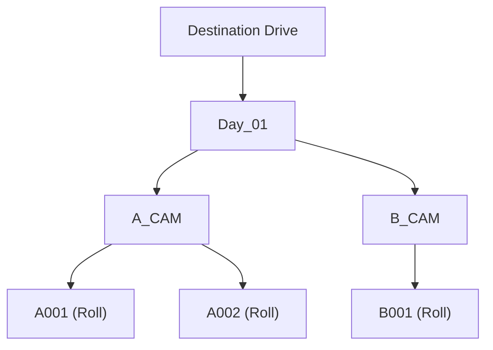

# COPA90 Ingest Tool 🎥

A professional, high-performance media ingestion and backup application built for creative workflows. This tool streamlines the process of offloading media from SD cards to production drives, ensuring organized folder structures and data integrity.


## ✨ Features

- **Automated Ingestion**: Offload SD cards with a single click.
- **Sequential Roll Numbering**: Automatically calculates the next roll number across all shoot days.
- **Drive Backups**: Integrated drive-to-drive mirroring for redundant backups.
- **Creative-Friendly UI**: A sleek, high-contrast dark mode interface inspired by IBM Carbon design principles.
- **Built for macOS**: Leverages Tauri for a native desktop experience.
- **Reliable Core**: Powered by robust `rsync` logic for safe and efficient file transfers.

## 📂 Ingestion Folder Structure

The application automatically organizes your footage into a standardized hierarchy:



## 🛠 Tech Stack

- **Core**: [Tauri v2](https://tauri.app/)
- **Frontend**: [React](https://reactjs.org/) + [TypeScript](https://www.typescriptlang.org/)
- **Styling**: Vanilla CSS + [Framer Motion](https://www.framer.com/motion/)
- **Logic**: Custom Bash scripts (`ingest.sh`, `backup.sh`)

## 🚀 Getting Started

### Prerequisites

- [Node.js](https://nodejs.org/) (latest LTS)
- [Rust](https://www.rust-lang.org/tools/install)
- `rsync`

### Installation

1. Clone the repository:
   ```bash
   git clone https://github.com/a133xz/copa90.git
   cd copa90
   ```

2. Install dependencies:
   ```bash
   npm install
   ```

3. Run in development mode:
   ```bash
   npm run tauri dev
   ```

### Building for Production

To create a signed macOS application:
```bash
npm run tauri build
```

---
*Created for the COPA90 Production Team.*
